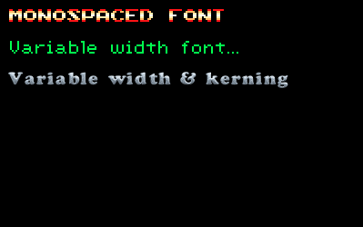

p5.bitmapFont 
=============



A [p5.js](http://p5js.org/) library that enables rendering bitmap fonts.


API
---

Usage:

```javascript

let sonicFont,
    scummFont;

  function setup() {
      createCanvas(400, 250);
  }

  function draw() {
      background(0);

      noTint();
      bitmapTextFont(sonicFont);
      bitmapText(`Monospaced font ${frameCount}`, 20, 20);

      tint(0, 255, 0);
      bitmapTextFont(scummFont);
      bitmapText(`-> Variable Width Font...`, 20, 50);
  }

  function preload() {
      sonicFont = loadBitmapFont('data/sonicFont@2.png', {
          glyphWidth: 8 * 2,
          glyphHeight: 8 * 2,
          glyphBorder: 0,
          rows: 12,
          cols: 8,
          kerning: 0
      });

      scummFont = loadBitmapFont('data/var-width/scumm.png', 'data/var-width/scumm.json');
  }

```


TODO:
-----

- fix exposed currFont var
- jslint code
- test perf on non-static strings
- add static strings?
